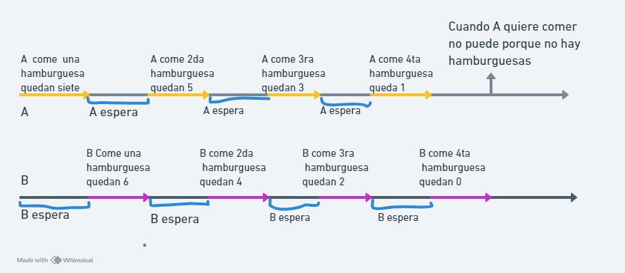

# practico2

Respuesta al practico numero 3
a) ¿Qué se puede notar con respecto al tiempo de ejecución? ¿Es predecible? 
El tiempo de ejecución del código con hilos es más rápido que el tiempo de ejecución del código sin hilos. El código con hilos tardo 4.07837 segundos, 4.04107 segundos, 4.06034 segundos. El código sin hilos 5.18115 segundos, 5.17705 segundos,5.16599 segundos. el tiempo de ejecución para cada código es predecible, son similares todas las veces.
 b) Comparar con un compañero el tiempo de ejecución. ¿Son iguales? 
Los tiempos de ejecución de mi compañero y los míos son similares de siendo el código con hilos más rápido en su ejecución que el código sin hilos. 
c) El símbolo “#” se utiliza para realizar comentarios en python, los comentarios son líneas de texto que no son ejecutadas por el intérprete de Python y se utilizan para explicar el propósito, el funcionamiento del código o dejar lineas comentadas para usarlas luego. 
Al sacar los # del codigo esas lineas comentadas hacian que el codigo durara mas tiempo porque tambien tenia que ejecutar esas lineas.

