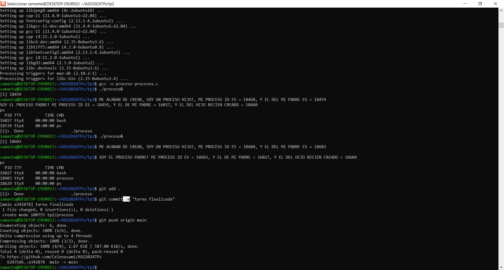

# practico2

Respuesta al practico numero 3

a) ¿Qué se puede notar con respecto al tiempo de ejecución? ¿Es
predecible?
El tiempo de ejecución de el codigo con hilos es mas rápido que el tiempo de ejecución del codigo sin hilos.
El codigo con hilos tardo 4.07837 segundos, 4.04107 segundos, 4.06034 segundos. 
El codigo sin hilos 5.18115 segundos, 5.17705 segundos,5.16599 segundos. 
el tiempo de ejecución para cada codigo es predecxible. son similares todas las veces
b) Comparar con un campañero el tiempo de ejecución. ¿Son iguales?
Los tiempos de ejecucion de mi compañero y los mios son similares de siendo el codigo con hilos mas rápido en su ejecución que el codigo sin hilos.
c) el simbolo # se utiliza para realizar comentarios en python, los comentarios son líneas de texto que no son ejecutadas por el intérprete de Python y se utilizan para explicar el propósito o el funcionamiento del código.
